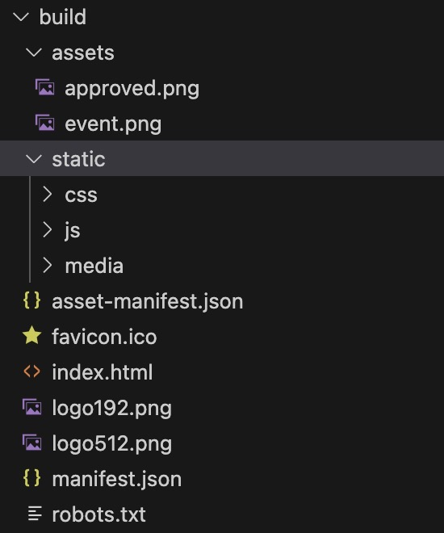

# [CS304] Team Project - Sprint 2 
[TOC]

## Part1. Metrics
对于这部分，我们使用了一个脚本来计算我们项目的复杂性指标。
```python
import os
import json
import subprocess

def count_lines_of_code_and_files(path, extensions):
    total_lines = 0
    total_files = 0
    for root, _, files in os.walk(path):
        for file in files:
            if file.endswith(extensions):
                total_files += 1
                with open(os.path.join(root, file), 'r', encoding='utf-8', errors='ignore') as f:
                    total_lines += sum(1 for _ in f)
    return total_lines, total_files

def count_dependencies(package_file):
    with open(package_file, 'r', encoding='utf-8') as f:
        if package_file.endswith('pom.xml'):
            return sum(1 for line in f if '<dependency>' in line)
        elif package_file.endswith('package.json'):
            package_data = json.load(f)
            dependencies = package_data.get('dependencies', {})
            dev_dependencies = package_data.get('devDependencies', {})
            return len(dependencies) + len(dev_dependencies)
    return 0

def count_directories(path):
    total_dirs = 0
    for _, dirs, _ in os.walk(path):
        total_dirs += len(dirs)
    return total_dirs

def main():
    project_root = r'C:\Users\yihan\Desktop\team-project-24spring-20'  # Set this to your project root if running from another directory
    backend_path = os.path.join(project_root, 'BackEnd')
    frontend_path = os.path.join(project_root, 'front-end')

    backend_extensions = ('.java')
    frontend_extensions = ('.js', '.jsx')

    backend_lines, backend_files = count_lines_of_code_and_files(backend_path, backend_extensions)
    frontend_lines, frontend_files = count_lines_of_code_and_files(frontend_path, frontend_extensions)

    backend_dependencies = count_dependencies(os.path.join(backend_path, 'pom.xml'))
    frontend_dependencies = count_dependencies(os.path.join(frontend_path, 'package.json'))

    backend_packages = count_directories(os.path.join(backend_path, 'src', 'main', 'java'))
    frontend_modules = count_directories(os.path.join(frontend_path, 'src'))


    print(f"Backend - Lines of Code: {backend_lines}, Files: {backend_files}, Packages: {backend_packages}, Dependencies: {backend_dependencies}")
    print(f"Frontend - Lines of Code: {frontend_lines}, Files: {frontend_files}, Modules: {frontend_modules}, Dependencies: {frontend_dependencies}")

if __name__ == '__main__':
    main()
```
执行结果如下图所示


## Part2. Documentation

### Documentation for end users: 
点击查看
[readme](https://github.com/sustech-cs304/team-project-24spring-20/blob/main/readme_2024-06-04.md)
### Documentation for developers
点击查看
[API documentation](https://github.com/sustech-cs304/team-project-24spring-20/blob/main/api%E6%96%87%E6%A1%A3.md)

## Part3. Tests

### 1. 使用的技术/工具/框架

我们项目的自动化测试策略包括了以下几个关键工具和技术：

- **JUnit 5**: 主要用于单元测试，它提供了灵活的测试结构和断言库来验证代码的正确性。
- **Mockito**: 用于模拟复杂依赖，确保单元测试的独立性和重点关注被测单元的行为。
- **Spring Test**: 针对Spring框架的集成测试，提供了全面的测试支持，包括数据库交互和Web层测试。
- **Jacoco**: 生成详细的代码覆盖率报告，帮助我们评估测试的广度和深度。
- **Maven Surefire Plugin**: 自动执行测试，并生成报告。

### 2. 测试代码或相关文档

为了保证代码质量和及时反馈，我们在项目的 `src/test` 目录下维护了所有的测试代码。下面我们选取了几张截图作为示例。


### 3. 测试的有效性

-Surefire Report

-Jacoco Coverage Report


- **分析**：如Surefire报告所示，我们一共有151个测试，测试的成功率为100%。如Jacoco报告所示，我们测试的代码覆盖率达到了近80%，分支覆盖率也达到了近75%。


## Part4. Build

### 首先，我们使用Jenkins做了一个CI/CD的pipeline，其中包括项目的build以及部署的过程

### [Jenkinsfile链接](https://github.com/sustech-cs304/team-project-24spring-20/blob/main/Jenkinsfile)


### 前端构建：

### Build System：Webpack

### Buildfile: package.json

### 命令：```npm run build```

### [package.json链接](https://github.com/sustech-cs304/team-project-24spring-20/blob/main/front-end/package.json)


### Tasks executed in a build(前端):

#### 编译和打包

1. **使用 Babel 编译 JavaScript/JSX 代码**：

2. **使用 Webpack 打包所有依赖和资源**：


#### 代码优化

1. **进行 Tree Shaking 去除无用代码**：
    - Webpack 内置的 Tree Shaking 功能会自动去除未使用的代码，CRA 默认启用此功能。
    ```json
    {
      "dependencies": {
        "react-scripts": "5.0.1"
      }
    }
    ```

2. **压缩 JavaScript 和 CSS 文件**：
    - `react-scripts build` 会使用 `TerserPlugin` 压缩 JavaScript，使用 `css-minimizer-webpack-plugin` 压缩 CSS。
    ```json
    {
      "dependencies": {
        "react-scripts": "5.0.1"
      }
    }
    ```

3. **处理代码分割，生成按需加载的代码块**：
    - Webpack 的代码分割功能会通过动态导入和 `SplitChunksPlugin` 处理代码分割。CRA 默认配置会启用这些功能。
    ```json
    {
      "dependencies": {
        "react-scripts": "5.0.1"
      }
    }
    ```

### The final artifacts produced by a successful build.（前端）



### 后端构建：
### Build System：Maven
### Buildfile: pom.xml
### [pom.xml链接](https://github.com/sustech-cs304/team-project-24spring-20/blob/main/BackEnd/pom.xml)
### 命令：```mvn clean package -Dmaven.test.skip=true```

### The final artifacts produced by a successful build.（后端）


## Part5 Deployment

### 我们使用Jenkins做了一个CI/CD的pipeline，其中包括项目的build以及部署的过程

### [Jenkinsfile链接](https://github.com/sustech-cs304/team-project-24spring-20/blob/main/Jenkinsfile)


### 工具：Docker Jenkins
### [前端Dockerfile链接](https://github.com/sustech-cs304/team-project-24spring-20/blob/main/front-end/Dockerfile)

### [后端Dockerfile链接](https://github.com/sustech-cs304/team-project-24spring-20/blob/main/BackEnd/Dockerfile)

### 正确的Docker Build展示

- Jenkins Stage的展示


- Jenkins docker build 前端输出的展示


- Jenkins docker build 后端输出的展示


- 镜像以及容器的展示

